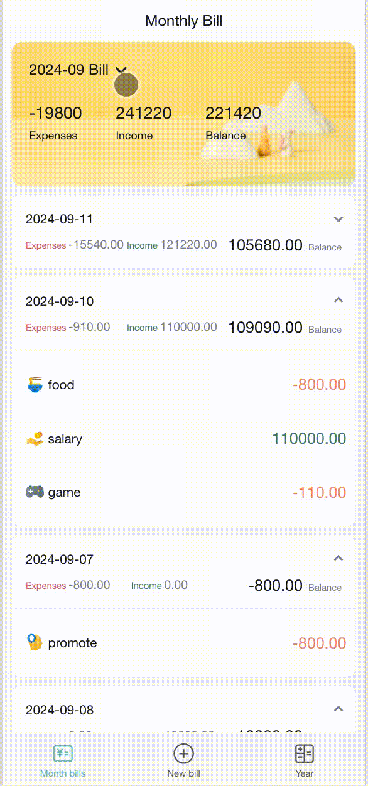

# Title: Expense Tracker - Smart Budgeting Made Easy

## Introduction:

Expense Tracker is a smart budgeting application developed based on the latest React 18 technology, designed to help you effortlessly manage your personal finances, achieve rational spending, and financial freedom. Whether it's daily expenses, bill payments, or budget planning, Expense Tracker can meet your needs and make financial management simple and enjoyable.

###Demo Screenshots:

## Features:

Smart Expense Tracking: Utilizing intelligent algorithms, Expense Tracker can quickly record your expenses and income, allowing you to easily grasp your financial situation.
Personalized Categories: Support for custom category labels enables you to flexibly manage various types of expenses according to your needs, gaining a better understanding of cash flow.
Financial Analysis: Providing detailed financial reports and charts to help you analyze spending habits, forecast future expenses, and make rational financial decisions.
Budget Management: Set budget goals, and Expense Tracker will alert you to overspending situations, helping you control expenses and achieve financial planning.

## In the project directory, you can run:

`npm i` to install all libs.

### `npm run server` to start the mock up back-end.

### `npm run start` to start the front-end app.

Runs the app in the development mode.\
Open [http://localhost:3000](http://localhost:3000) to view it in your browser.

The page will reload when you make changes.\
You may also see any lint errors in the console.

### `npm test`

Launches the test runner in the interactive watch mode.\
See the section about [running tests](https://facebook.github.io/create-react-app/docs/running-tests) for more information.

### `npm run build`

Builds the app for production to the `build` folder.\
It correctly bundles React in production mode and optimizes the build for the best performance.

The build is minified and the filenames include the hashes.\
Your app is ready to be deployed!

See the section about [deployment](https://facebook.github.io/create-react-app/docs/deployment) for more information.
